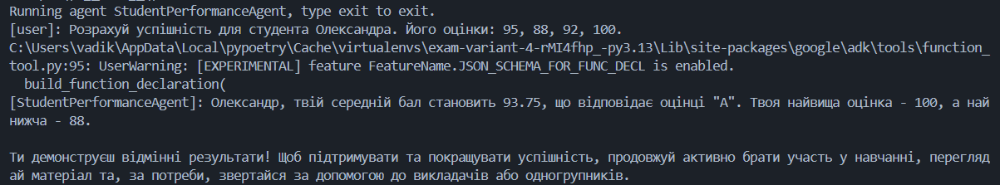
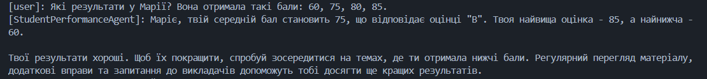
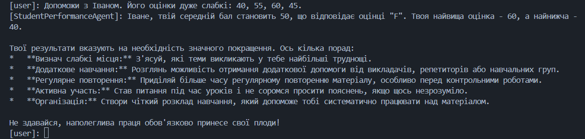

# Звіт з виконання практичного завдання з ООП

**Студент:** Рекунов Вадим
**Група:** КН-31
**Варіант:** 4 (Агент успішності студентів)
**Посилання на GitHub:** [Вставте посилання на ваш репозиторій]

## 1. Загальна структура проекту
Проект ініціалізовано та налаштовано згідно з вимогами:
* Використано менеджер пакетів **Poetry** (ініціалізовано у віртуальному середовищі).
* Встановлені необхідні залежності: `google-adk`, `python-dotenv`.
* Наявний файл `.gitignore` (середовище `.venv` та `.env` файл ігноруються).
* Наявний файл `README.md` з описом проекту.
* Запуск проекту здійснюється командою `adk run .`.

## 2. Реалізація ООП парадигм
У файлі `agent.py` реалізовано систему обліку успішності з демонстрацією всіх 4-х парадигм ООП:

1. **Абстракція:** Створено абстрактний клас `Person` з абстрактним методом `get_role()`, який визначає загальний інтерфейс для всіх учасників освітнього процесу.
2. **Наслідування:** Створено класи `Student` та `Teacher`, які успадковують базовий функціонал від класу `Person`.
3. **Інкапсуляція:** У класі `Student` оцінки зберігаються у приватному списку `__grades`. Доступ до списку та його модифікація здійснюються виключно через публічні методи класу (`add_grade`, `average`, `min_grade`, `max_grade`).
4. **Поліморфізм:** Метод `get_role()` перевизначено в класах `Student` та `Teacher` так, щоб він повертав різні значення ("Студент" або "Викладач") залежно від об'єкта, який його викликає.

## 3. Налаштування AI-Агента
* **Інструмент (Tool):** Створено звичайну Python-функцію `calculate_grade(name, scores)`, яка створює об'єкт класу `Student`, заповнює його оцінками та викликає інкапсульовані методи для розрахунку середнього балу, мін/макс оцінки та визначення літерного грейду (A, B, C, F).
* **Агент:** Налаштовано `root_agent` за допомогою фреймворку Google ADK. Агенту передано інструкції працювати як освітній асистент, українською мовою, та надано доступ до інструменту `calculate_grade`.

## 4. Демонстрація роботи агента (Логи діалогів)

### Діалог 1: Високий рівень успішності (Грейд A)
**Користувач:** Розрахуй успішність для студента Олександра. Його оцінки: 95, 88, 92, 100.
**Агент:** > [Вставте сюди текст відповіді агента або додайте скріншот: 
### Діалог 2: Середній рівень успішності (Грейд B/C)
**Користувач:** Які результати у Марії? Вона отримала такі бали: 60, 75, 80, 85.
**Агент:** > 

### Діалог 3: Низький рівень успішності (Грейд F)
**Користувач:** Допоможи з Іваном. Його оцінки дуже слабкі: 40, 55, 60, 45.
**Агент:** > 

## Висновок
Завдання виконано в повному обсязі. AI-агент успішно взаємодіє з користувачем, коректно викликає розроблений інструмент, який, у свою чергу, використовує побудовану за всіма правилами ООП архітектуру класів.
