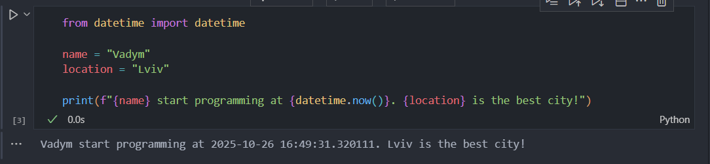
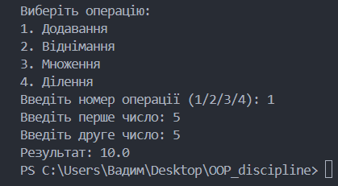

# Звіт до роботи
### Тема: Вступні заняття, налаштування середовища, прочаток роботи з Python та Markdown.
### Мета роботи: Налаштувати середовище роботи VS Code, створити репозиторій Github та налаштувати інтеграцію з ним, написати першу програму на Python та створити звіт з використанням форматування Markdown;
### Порядок виконання роботи:
* Встановив VSCode;
* Встановив плагіни: Python, Jupiter, Copilot;
# Перша робота:
```
from datetime import datetime

name = "Vadym"
location = "Lviv"

print(f"{name} start programming at {datetime.now()}. {location} is the best city!")
```
* ### Програма вивела:
```
Vadym start programming at 2025-10-26 16:41:37.170949. Lviv is the best city!
```
* ### Створив файл 1.ipynb, у ньому створив поле markdown і написав перший код, після цього створив поле для коду:

* ### у файлі ai.py, попросив Copilot написати програму за запитом: "запитайте у ChatGPT яку б першу програму написав АІ та чи б міг АІ пояснити її."
```
def add(x, y):
    return x + y

def subtract(x, y):
    return x - y

def multiply(x, y):
    return x * y

def divide(x, y):
    if y == 0:
        return "Ділення на нуль неможливе"
    return x / y

print("Виберіть операцію:")
print("1. Додавання")
print("2. Віднімання")
print("3. Множення")
print("4. Ділення")

choice = input("Введіть номер операції (1/2/3/4): ")

num1 = float(input("Введіть перше число: "))
num2 = float(input("Введіть друге число: "))

if choice == '1':
    print("Результат:", add(num1, num2))
elif choice == '2':
    print("Результат:", subtract(num1, num2))
elif choice == '3':
    print("Результат:", multiply(num1, num2))
elif choice == '4':
    print("Результат:", divide(num1, num2))
else:
    print("Невірний вибір")
```
* ### Отримав такий результат:


# Висновок:
#### Підчас виконання роботи навчився заповнювати файл MarkDown, працювати з Copilot AI, використовувати NoteBook та інсталювати плагіни.

