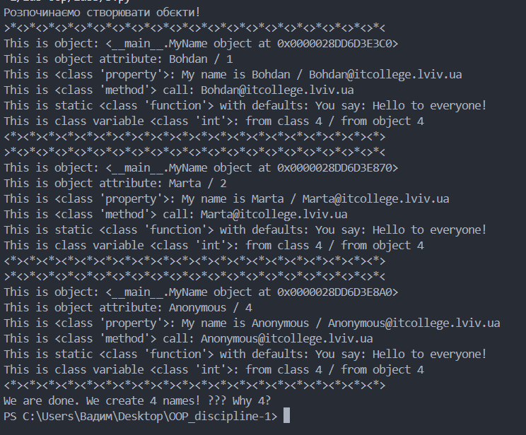
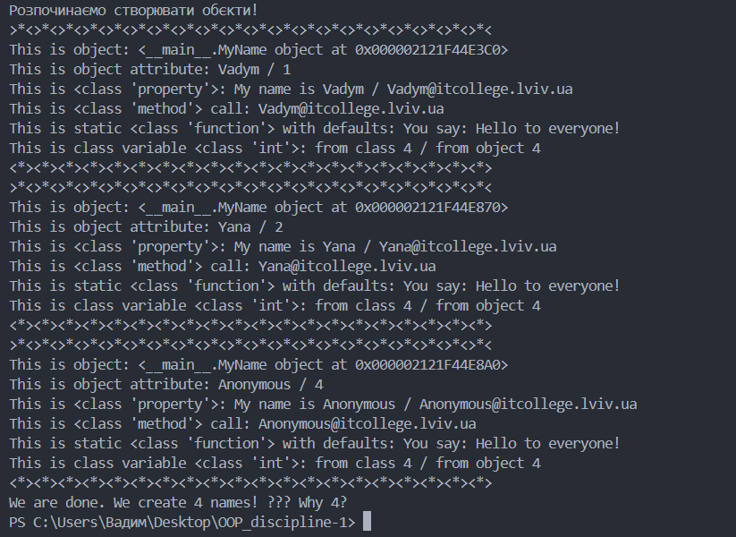
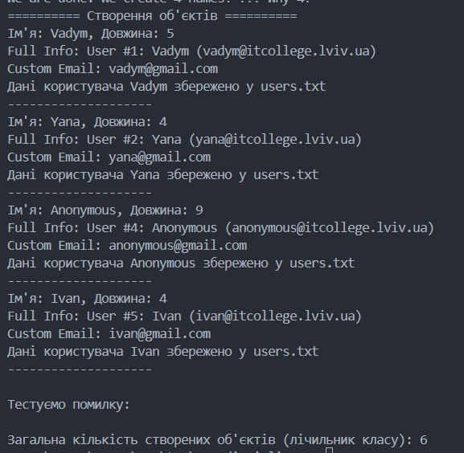
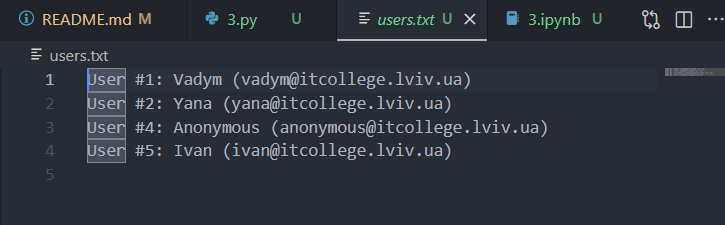

# Звіт до роботи
### Мета роботи: Навчитись використовувати основні принципи ООП, розглянути кострукції побудови класу та створення обєктів та навчитись працювати з ними
### Хід роботи:

### 1. Взяв код з лекціїї:
```

class MyName:
    """Опис класу / Документація
    """
    total_names = 0 #Class Variable

    def __init__(self, name=None) -> None:
        """Ініціалізація класу
        """
        self.name = name if name is not None else self.anonymous_user().name #Class attributes / Instance variables
        MyName.total_names += 1 #modify class variable
        self.my_id = self.total_names

    @property
    def whoami(self) -> str: 
        """Class property
        return: повертаємо імя 
        """
        return f"My name is {self.name}"
    
    @property
    def my_email(self) -> str:
        """Class property
        return: повертаємо емейл
        """
        return self.create_email()
    
    def create_email(self) -> str:
        """Instance method
        """
        return f"{self.name}@itcollege.lviv.ua"

    @classmethod
    def anonymous_user(cls):
        """Classs method
        """
        return cls("Anonymous")
    
    @staticmethod
    def say_hello(message="Hello to everyone!") -> str:
        """Static method
        """
        return f"You say: {message}"


print("Розпочинаємо створювати обєкти!")

names = ("Bohdan", "Marta", None)
all_names = {name: MyName(name) for name in names}

for name, me in all_names.items():
    print(f"""{">*<"*20}
This is object: {me} 
This is object attribute: {me.name} / {me.my_id}
This is {type(MyName.whoami)}: {me.whoami} / {me.my_email}
This is {type(me.create_email)} call: {me.create_email()}
This is static {type(MyName.say_hello)} with defaults: {me.say_hello()} 
This is class variable {type(MyName.total_names)}: from class {MyName.total_names} / from object {me.total_names}
{"<*>"*20}""")

print(f"We are done. We create {me.total_names} names! ??? Why {MyName.total_names}?")
```

### Програма вивела:


### 2. Модифікував програму додавши свої ім'я:
```

class MyName:
    """Опис класу / Документація
    """
    total_names = 0 #Class Variable

    def __init__(self, name=None) -> None:
        """Ініціалізація класу
        """
        self.name = name if name is not None else self.anonymous_user().name #Class attributes / Instance variables
        MyName.total_names += 1 #modify class variable
        self.my_id = self.total_names

    @property
    def whoami(self) -> str: 
        """Class property
        return: повертаємо імя 
        """
        return f"My name is {self.name}"
    
    @property
    def my_email(self) -> str:
        """Class property
        return: повертаємо емейл
        """
        return self.create_email()
    
    def create_email(self) -> str:
        """Instance method
        """
        return f"{self.name}@itcollege.lviv.ua"

    @classmethod
    def anonymous_user(cls):
        """Classs method
        """
        return cls("Anonymous")
    
    @staticmethod
    def say_hello(message="Hello to everyone!") -> str:
        """Static method
        """
        return f"You say: {message}"


print("Розпочинаємо створювати обєкти!")

names = ("Vadym", "Yana", None)
all_names = {name: MyName(name) for name in names}

for name, me in all_names.items():
    print(f"""{">*<"*20}
This is object: {me} 
This is object attribute: {me.name} / {me.my_id}
This is {type(MyName.whoami)}: {me.whoami} / {me.my_email}
This is {type(me.create_email)} call: {me.create_email()}
This is static {type(MyName.say_hello)} with defaults: {me.say_hello()} 
This is class variable {type(MyName.total_names)}: from class {MyName.total_names} / from object {me.total_names}
{"<*>"*20}""")

print(f"We are done. We create {me.total_names} names! ??? Why {MyName.total_names}?")

```

### Модифікована програма вивела:


### 3. Відповіді на запитання:
#### 1. Чому коли передаємо значення None створюється об'єкт з іменем Anonymous?
Це прописано в конструкторі __init__. Рядок коду: self.name = name if name is not None else self.anonymous_user().name Це тернарний оператор. Він каже: "Якщо name є, візьми його. Якщо name це None, виклич метод anonymous_user(), створи тимчасовий об'єкт з іменем "Anonymous" і візьми ім'я звідти".

####  2. Як змінити текст привітання при виклику методу say_hello()?
Метод say_hello приймає аргумент message. Щоб змінити текст, просто передайте рядок у дужках:
```
print(MyName.say_hello("Привіт, світе!"))
```

#### 3. Чому маємо різну кількість імен (Names vs Total Names)?
Припустbмо, у списку names є: ["Bohdan", "Marta", None]. Це 3 елементи.

Але MyName.total_names покаже 4.

Чому? Коли програма обробляє None:

Запускається __init__.

Він бачить None і викликає self.anonymous_user().

Метод anonymous_user викликає cls("Anonymous") -> це створює новий (окремий) екземпляр класу!

Для цього "внутрішнього" екземпляра знову запускається __init__, і лічильник total_names збільшується (+1).

Потім продовжується створення початкового об'єкта (замість None), і лічильник збільшується ще раз (+1). Тобто одне None породжує два збільшення лічильника (одне для допоміжного об'єкта, одне для основного).

### 4. Модифікована програма (Виконання всіх завдань)
Нижче наведено повністю оновлений код класу, який включає всі додаткові завдання:

Підрахунок букв.

Автоматична велика літера.

Зміна домену пошти.

Валідація (тільки літери).

Властивість full_name.

Збереження у файл.

```
import os

class MyName:
    total_names = 0 

    def __init__(self, name=None) -> None:
        self.check_name(name) # Перевірка на валідацію перед створенням
        
        # Логіка з Anonymous
        if name is None:
            temp_user = self.anonymous_user()
            self.name = temp_user.name
        else:
            # Модифікуємо: завжди з великої літери
            self.name = name.capitalize()

        MyName.total_names += 1
        self.my_id = self.total_names

    @staticmethod
    def check_name(name):
        """Перевірка: ім'я може містити лише літери (якщо не None)"""
        if name is not None and not name.isalpha():
            raise ValueError(f"Помилка: Ім'я '{name}' може містити лише літери!")

    def count_letters(self) -> int:
        """Допишіть функцію: рахує кількість букв"""
        return len(self.name)

    # Змінюємо метод create_email (додаємо аргумент domain)
    def create_email(self, domain="itcollege.lviv.ua") -> str:
        return f"{self.name.lower()}@{domain}"

    @property
    def full_name(self) -> str:
        """Нова властивість: повертає розширений опис"""
        return f"User #{self.my_id}: {self.name} ({self.create_email()})"

    def save_to_file(self, filename="users.txt"):
        """Реалізуємо метод запису у файл"""
        with open(filename, "a", encoding="utf-8") as f:
            f.write(self.full_name + "\n")
        print(f"Дані користувача {self.name} збережено у {filename}")

    # --- Старі методи без змін ---
    @classmethod
    def anonymous_user(cls):
        return cls("Anonymous")
    
    @staticmethod
    def say_hello(message="Hello to everyone!") -> str:
        return f"You say: {message}"


# --- ПЕРЕВІРКА НОВОГО ФУНКЦІОНАЛУ ---

try:
    # 1. Створюємо список (додайте своє ім'я)
    names_list = ["bohdan", "Marta", None, "Ivan"] 
    
    print(f"{'='*10} Створення об'єктів {'='*10}")
    objects = [MyName(n) for n in names_list]

    for person in objects:
        # 2. Виводимо кількість букв
        print(f"Ім'я: {person.name}, Довжина: {person.count_letters()}")
        
        # 3. Виводимо full_name
        print(f"Full Info: {person.full_name}")
        
        # 4. Змінюємо email (модифікація після @)
        custom_email = person.create_email(domain="gmail.com")
        print(f"Custom Email: {custom_email}")

        # 5. Зберігаємо у файл
        person.save_to_file()
        print("-" * 20)

    # 6. Тест валідації (має викликати помилку)
    print("\nТестуємо помилку:")
    bad_user = MyName("User123") 

except ValueError as e:
    print(f"ЗЛОВИЛИ ПОМИЛКУ: {e}")

print(f"\nЗагальна кількість створених об'єктів (лічильник класу): {MyName.total_names}")
```

### Програма вивела:


